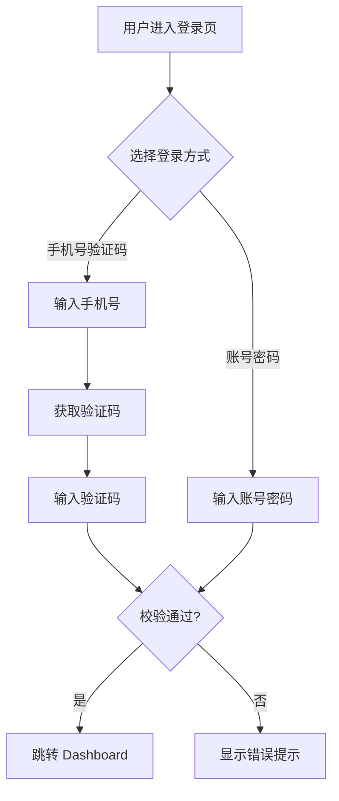
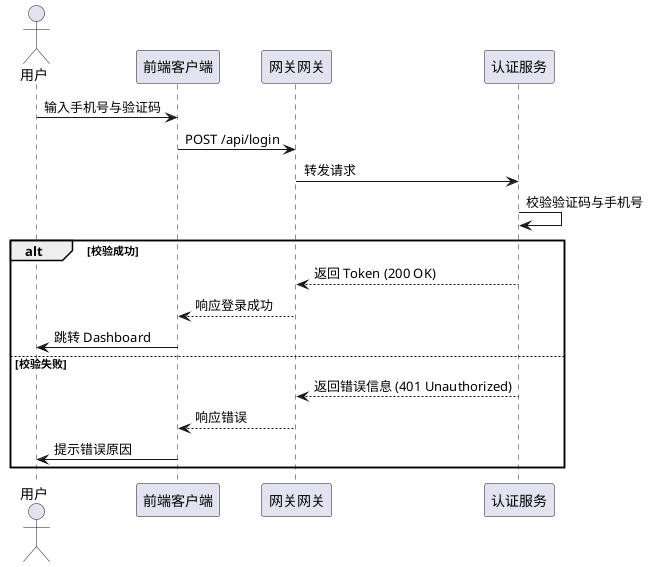

# Demo 需求：用户登录模块

## 1. 业务背景
为了保障用户数据安全，我们需要重构当前的登录模块，支持手机号验证码登录与密码登录。

## 2. 业务流程图 (Mermaid)

## 3. 时序图演示 (PlantUML)

## 4. 核心功能点
- 手机号 + 验证码登录 (默认)
- 账号 + 密码登录
- 忘记密码流程

## 4. 验收标准
- [ ] 手机号格式校验错误时，输入框下方显示红色提示。
- [ ] 验证码发送后需有 60s 倒计时。
- [ ] 登录成功后跳转到 `/dashboard`。

## 5. UI/UX 专注测试
> 👉 请使用右侧顶部的下拉菜单切换原型视角 (Focus Mode)，测试对应的组件状态。
