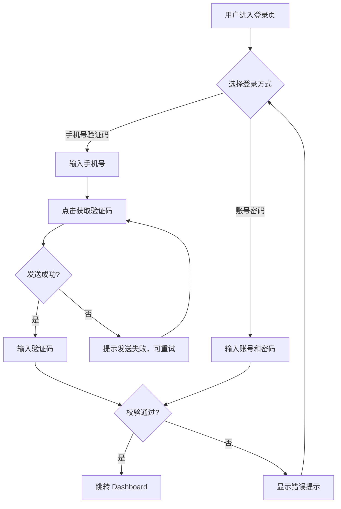
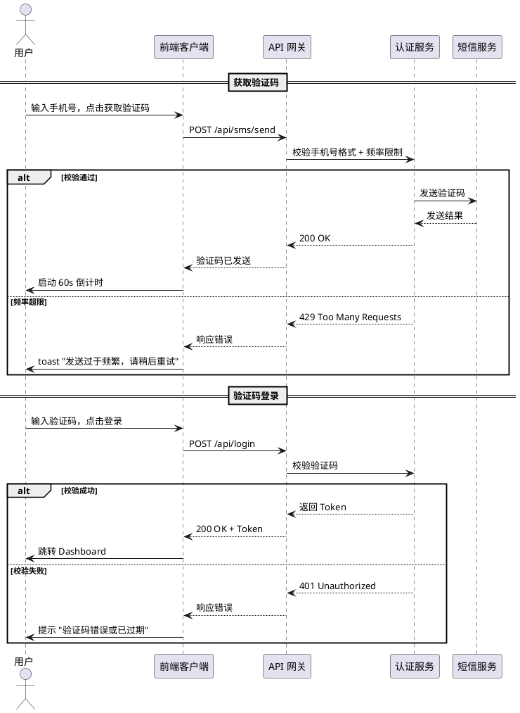

# PRD — 用户登录模块 (FEAT-DEMO)

> 编写规范详见 `.claude/templates/PRD-writing-guide.md`。
> 标记 `<!-- optional -->` 的模块按需保留或删除。

## 1. 业务目标

| 维度 | 内容 |
|------|------|
| 项目名称 | 用户登录模块重构 |
| 目标用户 | 全量注册用户 |
| 核心价值 | 提供安全便捷的登录体验，支持手机号验证码和账号密码两种方式 |
| 成功指标 | 登录成功率 >= 95%，验证码登录占比 >= 60% |
| 预估用户量级 | 日活 5000 UV |
| 预计上线 | 2025-02-01 |

## 2. 业务流程图

## 3. 时序图

## 4. 功能模块

### 4.1 手机号验证码登录

#### 4.1.1 获取验证码

**功能概述**: 用户输入手机号后获取短信验证码，用于身份验证登录。

**前置条件**: 用户处于登录页面，网络正常。

**操作步骤**:

1. 用户在手机号输入框输入 11 位手机号
2. 用户点击「获取验证码」按钮
3. 系统校验手机号格式并发送短信验证码

**预期结果**:

1. 输入框实时校验格式，非 11 位数字时按钮置灰
2. 点击后按钮变为「60s 后重新获取」并开始倒计时，倒计时期间按钮不可点击
3. 用户手机收到 6 位数字验证码短信

**异常情况**:

| 异常场景 | 系统响应 |
|---------|---------|
| 输入非 11 位或非数字字符 | 「获取验证码」按钮置灰，输入框下方提示 "请输入正确的手机号" |
| 同一手机号 60s 内重复请求 | 按钮置灰显示剩余倒计时秒数 |
| 同一手机号 10 分钟内发送 >= 5 次 | toast 提示 "发送过于频繁，请 10 分钟后重试"，按钮置灰 |
| 短信服务不可用 | toast 提示 "验证码发送失败，请稍后重试"，按钮恢复可点击 |
| 网络断开 | toast 提示 "网络连接失败，请检查网络" |

**业务规则与数据约束**:

- 手机号: 字符串，11 位纯数字，以 1 开头
- 验证码: 6 位纯数字，有效期 10 分钟
- 频率限制: 同一手机号 60s 内仅可发送 1 次，10 分钟内最多 5 次
- 倒计时: 前端本地计时 60s，不依赖后端

---

#### 4.1.2 验证码登录

**功能概述**: 用户输入手机号和验证码完成身份验证并登录系统。

**前置条件**: 用户已获取验证码，处于登录页面。

**操作步骤**:

1. 用户在验证码输入框输入 6 位验证码
2. 用户点击「登录」按钮
3. 系统校验手机号与验证码匹配性

**预期结果**:

1. 验证码输入框限制 6 位数字，满 6 位后「登录」按钮高亮可点击
2. 点击登录后显示 loading 状态，按钮不可重复点击
3. 校验通过后页面跳转至 `/dashboard`，本地存储 Token

**异常情况**:

| 异常场景 | 系统响应 |
|---------|---------|
| 验证码错误 | toast 提示 "验证码错误，请重新输入"，清空验证码输入框，剩余重试次数 -1 |
| 验证码过期（超过 10 分钟） | toast 提示 "验证码已过期，请重新获取"，清空输入框 |
| 连续错误 5 次 | toast 提示 "错误次数过多，请重新获取验证码"，当前验证码作废 |
| 接口超时（> 5s） | toast 提示 "登录请求超时，请重试"，按钮恢复可点击 |

**业务规则与数据约束**:

- 验证码校验: 同一验证码最多尝试 5 次，超限后自动作废
- Token: JWT 格式，有效期 7 天，存储于 localStorage
- 登录态互斥: 新设备登录后旧设备 Token 失效

---

### 4.2 账号密码登录

#### 4.2.1 密码登录

**功能概述**: 用户通过账号（手机号）和密码完成登录，作为验证码登录的备选方式。

**前置条件**: 用户已注册并设置过密码，处于登录页面。

**操作步骤**:

1. 用户点击登录页「密码登录」标签切换登录方式
2. 用户输入手机号和密码
3. 用户点击「登录」按钮

**预期结果**:

1. 页面切换为手机号 + 密码输入表单，验证码相关元素隐藏
2. 密码输入框默认掩码显示，右侧有可见性切换图标
3. 校验通过后跳转至 `/dashboard`，行为与验证码登录一致

**异常情况**:

| 异常场景 | 系统响应 |
|---------|---------|
| 账号或密码错误 | toast 提示 "账号或密码错误"（不区分具体错误项） |
| 连续错误 5 次 | 账号锁定 15 分钟，提示 "错误次数过多，账号已锁定 15 分钟" |
| 账号未注册 | 提示 "账号或密码错误"（不暴露账号是否存在） |

**业务规则与数据约束**:

- 密码: 8-20 位，须包含字母和数字
- 锁定策略: 连续错误 5 次锁定 15 分钟，锁定期间不接受登录请求
- 密码传输: 前端 RSA 加密后传输，禁止明文

---

## 5. 功能交互

| 交互链路 | 数据流转 | 影响 |
|---------|---------|------|
| 获取验证码 → 验证码登录 | 手机号自动填充到登录表单 | 验证码与手机号绑定校验 |
| 验证码登录/密码登录 → Dashboard | 登录成功返回 JWT Token | Token 写入 localStorage，后续接口携带 |
| 密码连续错误 → 账号锁定 | 锁定状态写入认证服务 | 锁定期间验证码登录不受影响 |

## 6. 功能边界

**包含**:
- 手机号 + 验证码登录
- 账号 + 密码登录
- 登录态 Token 管理

**不包含（本版本不做）**:
- 第三方登录（微信/支付宝）
- 忘记密码/重置密码
- 注册流程
- 生物识别登录（指纹/面容）

## 7. 非功能约束

- **性能**: 登录接口响应 <= 1s（P99），验证码发送接口 <= 2s，支持 500 QPS 并发
- **安全**: 密码 RSA 加密传输；验证码 5 次错误作废；密码 5 次错误锁定 15 分钟；同一 IP 每分钟最多 10 次登录请求
- **数据一致性**: Token 刷新期间旧 Token 保持有效（宽限期 30s），避免并发请求失败

## 8. 验收标准

- [ ] 输入非法手机号时，「获取验证码」按钮置灰且显示格式提示
- [ ] 验证码发送后按钮显示 60s 倒计时，倒计时内不可重复发送
- [ ] 10 分钟内同一手机号发送 >= 5 次后按钮置灰并 toast 提示
- [ ] 验证码正确时跳转 `/dashboard`，localStorage 中存在有效 Token
- [ ] 验证码错误 5 次后当前验证码作废，提示重新获取
- [ ] 密码登录连续错误 5 次后账号锁定 15 分钟
- [ ] 错误提示统一为 "账号或密码错误"，不暴露账号是否存在
- [ ] 切换登录方式时表单状态正确重置

## 9. 关联文档

- 项目概览: `../../begin.md`
- 进度追踪: `.artifacts/process.md`
- 决策记录: `.artifacts/notes.md`
